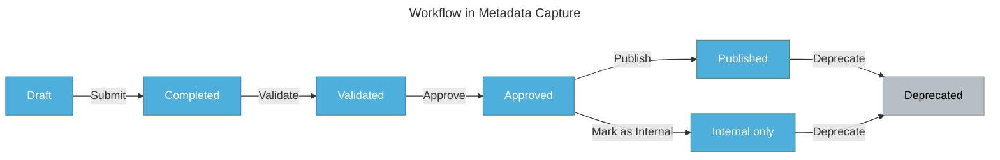

# The dataset workflow

Understand the dataset workflow so you can effectively manage datasets within Metadata Capture.

## Workflow overview

The **dataset workflow** in Metadata Capture reflects a typical **dataset lifecycle**, with additional approval steps to ensure that datasets are properly documented and reviewed before publication.

The following diagram illustrates this workflow. The boxes represent the lifecycle stages, and the arrows indicate the actions required to move the datasets to the next stage. Each stage represents a tab in the <u>dataset panel</u>.

 

:::note Revert to draft
You can  **revert** a dataset back to **draft** state at any stage in the workflow.
:::

## Workflow stages 

The following table shows how datasets progress through each stage from creation (draft) to publication and deprecation, and the steps involved in each stage:

| Action | Stage  | Resulting State  |
|--------|-------|-------------|
| Add a dataset  | **Draft** | Datasets are being added or edited.|
| Submit the dataset  | **Completed** | Datasets have been submitted for review. |
| Validate the dataset   | **Validated** | The accuracy of datasets have been confirmed, and are awaiting approval. |
| Approve the dataset  | **Approved** | The datasets meet the *Accord de Principe*, and are awaiting publication. |
| Publish the dataset as public  | **Published** | Datasets are published and accessible to all organisations. |
| Mark the dataset as internal  | **Internal Only** | Datasets are published and only accessible within the organisation. |
| Deprecate the dataset   | **Deprecated** | Datasets are no longer used or have been replaced by newer versions. |

:::info Roles and permissions

Each action in the dataset workflow requires specific **roles**, responsible for moving the datasets to the next stage. To view and perform actions on datasets, you must have the appropriate roles for the organisation you are viewing. To learn more about these roles, see <u>roles and permissions</u>.
