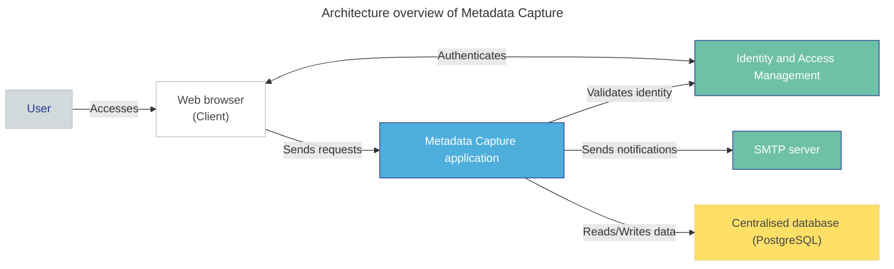

# Architecture overview

Metadata Capture is an open-source platform that you can deploy in your organisation's infrastructure. This self-hosted deployment model gives you complete control over the application. Before you begin deployment, understand the application architecture so you can prepare your environment.

The **Metadata Capture application** is a modular platform that integrates several components to enable secure, scalable dataset management. The following figure illustrates the high-level architecture of the system.

 

Metadata Capture integrates with your organisational infrastructure and is designed for flexible deployment. Here’s what you need to know before you begin deployment:

- **Core application:** The Metadata Capture application includes both a frontend (user interface) and backend services, designed to run on your infrastructure. Your users interact with the system through their web browser, which communicates directly with the application.

- **Authentication & access control:** The application relies on an external OpenID Connect **(OIDC)** provider to manage authentication and user permissions. Your organisation must have its own Identity and Access Management **(IAM)** system, which controls access and role assignments within Metadata Capture.

- **Centralised database:** Metadata Capture stores and retrieves all application data using a **PostgreSQL** database. Your organisation must provide its own PostgreSQL instance and grant Metadata Capture secure access to the database.

- **Email notifications:** Metadata Capture includes a notification feature that sends emails to relevant users during key events of the dataset lifecycle. For example, it sends an email when a dataset is submitted for validation, or when it is approved for publication. Your organisation must configure its own **SMTP server** to deliver these notifications.

Now that you understand the architecture, you can prepare your environment and [deploy the Metadata Capture application](deploy-metadata-capture.md).
